## Задание

1. Используя команду cat в терминале операционной системы Linux, создать
два файла Домашние животные (заполнив файл собаками, кошками,
хомяками) и Вьючные животными заполнив файл Лошадьми, верблюдами и
ослы), а затем объединить их. Просмотреть содержимое созданного файла.
Переименовать файл, дав ему новое имя (Друзья человека).

```
 alice@ubserv:~/gb_final_test$ cat >> домашние_животные
 собаки
 кошки
 хомяки
```

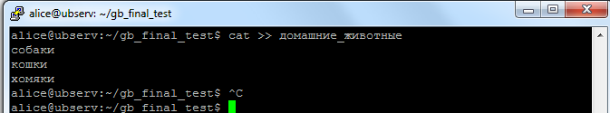

```
alice@ubserv:~/gb_final_test$ cat >> вьючные_животные
лошади
верблюды
ослы
```

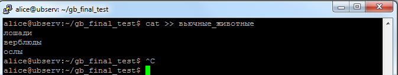

```
alice@ubserv:~/gb_final_test$ cat домашние_животные вьючные_животные > животные
alice@ubserv:~/gb_final_test$ cat животные
собаки
кошки
хомяки
лошади
верблюды
ослы
alice@ubserv:~/gb_final_test$ mv животные друзья_человека
alice@ubserv:~/gb_final_test$ ls
вьючные_животные  домашние_животные  друзья_человека
alice@ubserv:~/gb_final_test$
```

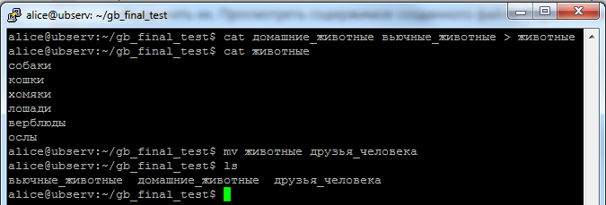

2. Создать директорию, переместить файл туда.

```
alice@ubserv:~/gb_final_test$ mkdir new_dir
alice@ubserv:~/gb_final_test$ mv друзья_человека new_dir/
alice@ubserv:~/gb_final_test$ ls new_dir
друзья_человека
alice@ubserv:~/gb_final_test$
```


3. Подключить дополнительный репозиторий MySQL. Установить любой пакет
из этого репозитория.

```
alice@ubserv:~$ sudo add-apt-repository 'deb http://repo.mysql.com/apt/ubuntu/ bionic mysql-8.0'
Repository: 'deb http://repo.mysql.com/apt/ubuntu/ bionic mysql-8.0'
Description:
Archive for codename: bionic components: mysql-8.0
More info: http://repo.mysql.com/apt/ubuntu/
Adding repository.
Press [ENTER] to continue or Ctrl-c to cancel.
```

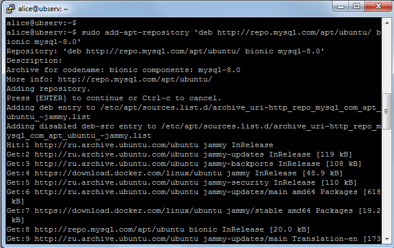

```
alice@ubserv:~$  wget -c https://repo.mysql.com/RPM-GPG-KEY-mysql-2022 -O- | sudo apt-key add -
```

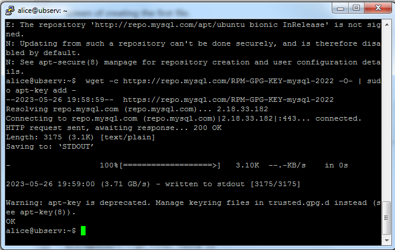

```
alice@ubserv:~$ sudo apt update
```

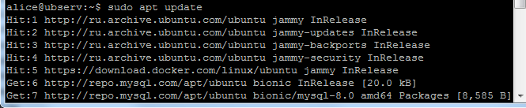

```
alice@ubserv:~$ sudo apt install mysql-router
```

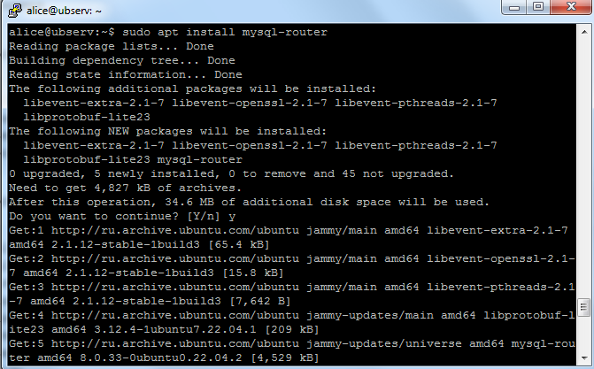

4. Установить и удалить deb-пакет с помощью dpkg

```
alice@ubserv:~$ curl -O http://ftp.de.debian.org/debian/pool/main/m/midori/midori_7.0-2.1_amd64.deb
  % Total    % Received % Xferd  Average Speed   Time    Time     Time  Current
                                 Dload  Upload   Total   Spent    Left  Speed
100  717k  100  717k    0     0   898k      0 --:--:-- --:--:-- --:--:--  898k
alice@ubserv:~$ sudo dpkg -i midori_7.0-2.1_amd64.deb
[sudo] password for alice:
Sorry, try again.
[sudo] password for alice:
Selecting previously unselected package midori.
(Reading database ... 74589 files and directories currently installed.)
Preparing to unpack midori_7.0-2.1_amd64.deb ...
Unpacking midori (7.0-2.1) ...
```

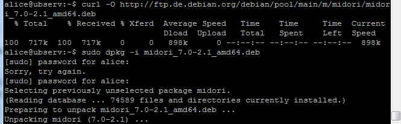

```
alice@ubserv:~$ sudo dpkg -r midori
[sudo] password for alice:
(Reading database ... 74706 files and directories currently installed.)
Removing midori (7.0-2.1) ...
Processing triggers for libc-bin (2.35-0ubuntu3.1) ...
Processing triggers for man-db (2.10.2-1) ...
alice@ubserv:~$
```

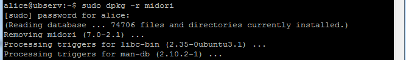


5. Выложить историю команд в терминале ubuntu

```
alice@ubserv:~$ history
    1  sudo shutdown now
    2  sudo apt update
    3  sudo apt upgrade
    4  sudo reboot now
    5  sudo apt install ca-certificates curl gnupg lsb-release
    6  sudo mkdir -p /etc/apt/keyrings
    7  curl -fsSL https://download.docker.com/linux/ubuntu/gpg | sudo gpg --dearmor -o /etc/apt/keyrings/docker.gpg
    8  echo   "deb [arch="$(dpkg --print-architecture)" signed-by=/etc/apt/keyrings/docker.gpg] https://download.docker.com/linux/ubuntu \
```

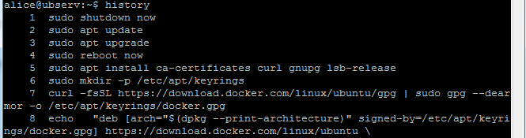

6. Нарисовать диаграмму, в которой есть класс родительский класс, домашние
животные и вьючные животные, в составы которых в случае домашних
животных войдут классы: собаки, кошки, хомяки, а в класс вьючные животные
войдут: Лошади, верблюды и ослы).

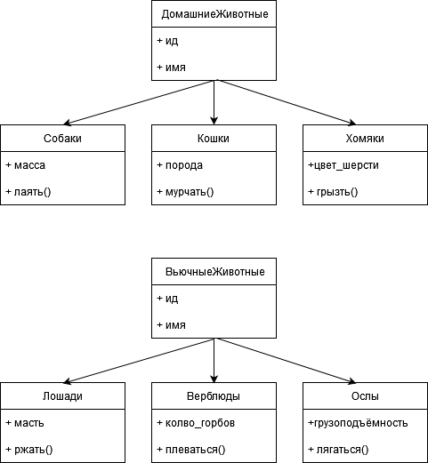

7. В подключенном MySQL репозитории создать базу данных “Друзья
человека”

```
mysql> CREATE DATABASE друзья_человека;
mysql> show databases;
+-------------------------------+
| Database                      |
+-------------------------------+
| information_schema            |
| mysql                         |
| performance_schema            |
| sys                           |
| друзья_человека               |
+-------------------------------+
```

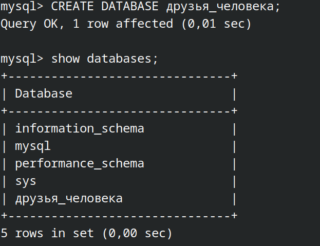

8. Создать таблицы с иерархией из диаграммы в БД

```
mysql> CREATE TABLE домашние_животные (   id INT AUTO_INCREMENT PRIMARY KEY,   name VARCHAR(255),   date_of_birth DATE );
Query OK, 0 rows affected (0,03 sec)

mysql> CREATE TABLE вьючные_животные (   id INT AUTO_INCREMENT PRIMARY KEY,   name VARCHAR(255),   date_of_birth DATE );
Query OK, 0 rows affected (0,12 sec)

mysql> show tables;
+-----------------------------------------+
| Tables_in_друзья_человека               |
+-----------------------------------------+
| вьючные_животные                        |
| домашние_животные                       |
+-----------------------------------------+
2 rows in set (0,01 sec)
```

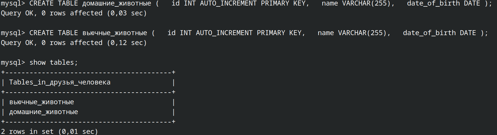

```
mysql> CREATE TABLE Собаки(
    ->   id INT NOT NULL AUTO_INCREMENT,
    ->   parent_id INT NOT NULL,
    ->   mass REAL,
    ->   PRIMARY KEY (id),
    ->   FOREIGN KEY (parent_id) REFERENCES домашние_животные(id)
    -> );

Query OK, 0 rows affected (0,15 sec)

mysql> CREATE TABLE Кошки(
    ->   id INT NOT NULL AUTO_INCREMENT,
    ->   parent_id INT NOT NULL,
    ->   breed VARCHAR(255),
    ->   PRIMARY KEY (id),
    ->   FOREIGN KEY (parent_id) REFERENCES домашние_животные(id)
    -> );
Query OK, 0 rows affected (0,04 sec)

mysql> CREATE TABLE хомяки(
    ->   id INT NOT NULL AUTO_INCREMENT,
    ->   parent_id INT NOT NULL,
    ->   furr_color VARCHAR(255),
    ->   PRIMARY KEY (id),
    ->   FOREIGN KEY (parent_id) REFERENCES домашние_животные(id)
    -> );
Query OK, 0 rows affected (0,04 sec)

mysql> CREATE TABLE лошади(
    ->   id INT NOT NULL AUTO_INCREMENT,
    ->   parent_id INT NOT NULL,
    ->   lear VARCHAR(255),
    ->   PRIMARY KEY (id),
    ->   FOREIGN KEY (parent_id) REFERENCES вьючные_животные(id)
    -> );
Query OK, 0 rows affected (0,03 sec)

mysql> CREATE TABLE верблюды(
    ->   id INT NOT NULL AUTO_INCREMENT,
    ->   parent_id INT NOT NULL,
    ->   bend_quantity INT,
    ->   PRIMARY KEY (id),
    ->   FOREIGN KEY (parent_id) REFERENCES вьючные_животные(id)
    -> );
Query OK, 0 rows affected (0,41 sec)

mysql> CREATE TABLE Ослы(
    ->   id INT NOT NULL AUTO_INCREMENT,
    ->   parent_id INT NOT NULL,
    ->   capacity REAL,
    ->   PRIMARY KEY (id),
    ->   FOREIGN KEY (parent_id) REFERENCES вьючные_животные(id)
    -> );
Query OK, 0 rows affected (0,12 sec)
```

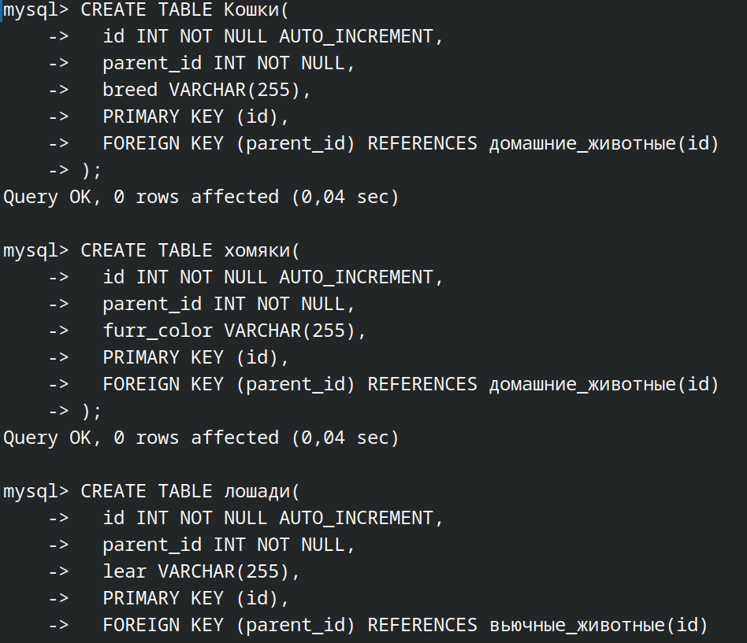

9. Заполнить низкоуровневые таблицы именами(животных), командами
которые они выполняют и датами рождения

```
mysql> INSERT INTO домашние_животные(name, date_of_birth) VALUES ('Лайка', '2015-03-12');
Query OK, 1 row affected (0,01 sec)
mysql> INSERT INTO Собаки(parent_id, mass) VALUES (LAST_INSERT_ID(), 9.4);
Query OK, 1 row affected (0,00 sec)

mysql> INSERT INTO домашние_животные(name, date_of_birth) VALUES ('Муся', '2023-001-10');
Query OK, 1 row affected (0,01 sec)
mysql> INSERT INTO Кошки(parent_id, breed) VALUES (LAST_INSERT_ID(), 'Сфинкс');
Query OK, 1 row affected (0,00 sec)

mysql> INSERT INTO домашние_животные(name, date_of_birth) VALUES ('Персик', '2022-03-08');
Query OK, 1 row affected (0,01 sec)
mysql> INSERT INTO хомяки(parent_id, furr_color) VALUES (LAST_INSERT_ID(), 'Розовый');
Query OK, 1 row affected (0,01 sec)

mysql> INSERT INTO вьючные_животные(name, date_of_birth) VALUES ('Ветер', '2018-10-02');
Query OK, 1 row affected (0,01 sec)
mysql> INSERT INTO лошади(parent_id, lear) VALUES (LAST_INSERT_ID(), 'Пегий');
Query OK, 1 row affected (0,01 sec)

mysql> INSERT INTO вьючные_животные(name, date_of_birth) VALUES ('Ветер', '2019-05-10');
Query OK, 1 row affected (0,02 sec)
mysql> INSERT INTO верблюды(parent_id, bend_quantity) VALUES (LAST_INSERT_ID(), 2);
Query OK, 1 row affected (0,01 sec)

mysql> INSERT INTO вьючные_животные(name, date_of_birth) VALUES ('Степан', '2022-11-25');
Query OK, 1 row affected (0,01 sec)
mysql> INSERT INTO Ослы(parent_id, capacity) VALUES (LAST_INSERT_ID(), 24.2);
Query OK, 1 row affected (0,00 sec)
```

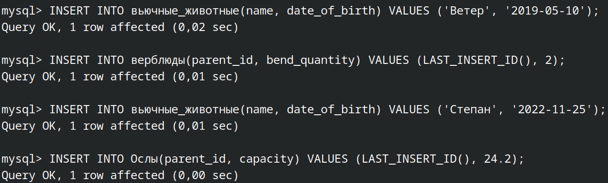

10. Удалив из таблицы верблюдов, т.к. верблюдов решили перевезти в другой
питомник на зимовку. Объединить таблицы лошади, и ослы в одну таблицу.

```
mysql> CREATE TEMPORARY TABLE temp_верблюды (parent_id INT);
Query OK, 0 rows affected (0,01 sec)

mysql> INSERT INTO temp_верблюды (parent_id) SELECT parent_id FROM верблюды;
Query OK, 1 row affected (0,00 sec)
Records: 1  Duplicates: 0  Warnings: 0

mysql> DROP TABLE верблюды;
Query OK, 0 rows affected (0,03 sec)

mysql> DELETE FROM вьючные_животные WHERE id IN (SELECT parent_id FROM temp_верблюды);
Query OK, 1 row affected (0,01 sec)

mysql> DROP TABLE temp_верблюды;
Query OK, 0 rows affected (0,00 sec)
```

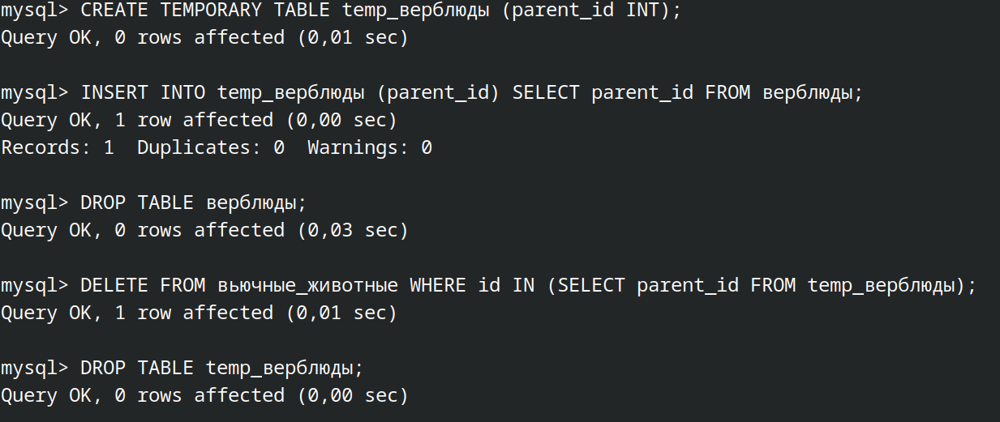

```
mysql> CREATE TABLE лошади_и_ослы(
    ->   id INT NOT NULL AUTO_INCREMENT,
    ->   parent_id INT NOT NULL,
    ->   lear VARCHAR(255),
    ->   capacity REAL,
    ->   PRIMARY KEY (id),
    ->   FOREIGN KEY (parent_id) REFERENCES вьючные_животные(id)
    -> );
Query OK, 0 rows affected (0,04 sec)

mysql> INSERT INTO лошади_и_ослы (parent_id, lear) SELECT parent_id, lear FROM лошади;
Query OK, 1 row affected (0,01 sec)
Records: 1  Duplicates: 0  Warnings: 0

mysql> INSERT INTO лошади_и_ослы (parent_id, capacity) SELECT parent_id, capacity FROM Ослы;
Query OK, 1 row affected (0,03 sec)
Records: 1  Duplicates: 0  Warnings: 0

mysql> drop table лошади;
Query OK, 0 rows affected (0,02 sec)

mysql> drop table Ослы;
Query OK, 0 rows affected (0,02 sec)

mysql> SELECT * FROM лошади_и_ослы;
+----+-----------+------------+----------+
| id | parent_id | lear       | capacity |
+----+-----------+------------+----------+
|  1 |         1 | Пегий      |     NULL |
|  2 |         3 | NULL       |     24.2 |
+----+-----------+------------+----------+
2 rows in set (0,00 sec)
```

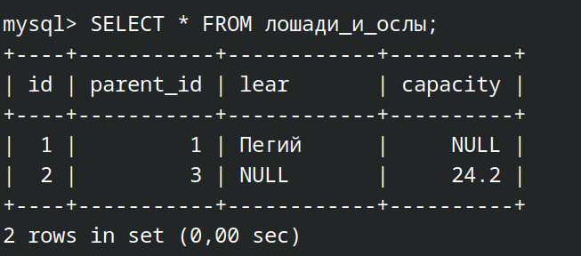

11.Создать новую таблицу “молодые животные” в которую попадут все
животные старше 1 года, но младше 3 лет и в отдельном столбце с точностью
до месяца подсчитать возраст животных в новой таблице

```
mysql> CREATE TABLE молодые_животные(
    ->  id INT AUTO_INCREMENT PRIMARY KEY,
    ->  name VARCHAR(255),
    ->  age_years INT,
    ->  age_months INT
    -> );
Query OK, 0 rows affected (0,03 sec)

mysql> INSERT INTO молодые_животные(name, age_years, age_months) SELECT name, FLOOR(DATEDIFF(NOW(), date_of_birth) / 365), MOD(DATEDIFF(NOW(), date_of_birth), 12) FROM домашние_животные;
Query OK, 3 rows affected (0,03 sec)

mysql> INSERT INTO молодые_животные(name, age_years, age_months) SELECT name, FLOOR(DATEDIFF(NOW(), date_of_birth) / 365), MOD(DATEDIFF(NOW(), date_of_birth), 12) FROM домашние_животные;
Query OK, 3 rows affected (0,03 sec)

mysql> DELETE FROM молодые_животные WHERE age_years < 1 OR age_years > 3;
Query OK, 4 rows affected (0,01 sec)

mysql> SELECT * FROM молодые_животные;
```

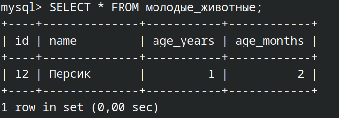

12. Объединить все таблицы в одну, при этом сохраняя поля, указывающие на
прошлую принадлежность к старым таблицам.

```
mysql> CREATE TABLE единая_таблица(
    ->  id INT AUTO_INCREMENT PRIMARY KEY,
    ->  name VARCHAR(255),
    ->  date_of_birth DATE,
    ->  mass REAL,
    ->  breed VARCHAR(255),
    ->  furr_color VARCHAR(255),
    ->  lear VARCHAR(255),
    ->  capacity REAL
    -> );
Query OK, 0 rows affected (0,14 sec)

mysql> INSERT INTO единая_таблица(name, date_of_birth, mass) SELECT домашние_животные.name, домашние_животные.date_of_birth, Собаки.mass FROM Собаки JOIN домашние_животные ON Собаки.parent_id = домашние_животные.id;
Query OK, 1 row affected (0,01 sec)
Records: 1  Duplicates: 0  Warnings: 0

mysql> INSERT INTO единая_таблица(name, date_of_birth, breed) SELECT домашние_животные.name, домашние_животные.date_of_birth, Кошки.breed FROM Кошки JOIN домашние_животные ON Кошки.parent_id = домашние_животные.id;
Query OK, 1 row affected (0,01 sec)
Records: 1  Duplicates: 0  Warnings: 0

mysql> INSERT INTO единая_таблица(name, date_of_birth, furr_color) SELECT домашние_животные.name, домашние_животные.date_of_birth, хомяки.furr_color FROM хомяки JOIN домашние_животные ON хомяки.parent_id = домашние_животные.id;
Query OK, 1 row affected (0,01 sec)
Records: 1  Duplicates: 0  Warnings: 0

mysql> INSERT INTO единая_таблица(name, date_of_birth, lear, capacity) SELECT вьючные_животные.name, вьючные_животные.date_of_birth, лошади_и_ослы.lear, лошади_и_ослы.capacity FROM лошади_и_ослы JOIN вьючные_животные ON лошади_и_ослы.parent_id = вьючные_животные.id;
Query OK, 2 rows affected (0,03 sec)
Records: 2  Duplicates: 0  Warnings: 0
```


13.Создать класс с Инкапсуляцией методов и наследованием по диаграмме.

14. Написать программу, имитирующую работу реестра домашних животных.
В программе должен быть реализован следующий функционал:
14.1 Завести новое животное
14.2 определять животное в правильный класс
14.3 увидеть список команд, которое выполняет животное
14.4 обучить животное новым командам
14.5 Реализовать навигацию по меню

15.Создайте класс Счетчик, у которого есть метод add(), увеличивающий̆
значение внутренней̆int переменной̆на 1 при нажатие “Завести новое
животное” Сделайте так, чтобы с объектом такого типа можно было работать в
блоке try-with-resources. Нужно бросить исключение, если работа с объектом
типа счетчик была не в ресурсном try и/или ресурс остался открыт. Значение
считать в ресурсе try, если при заведения животного заполнены все поля.

Задания 13, 14 и 15 выполнены в пакете app в этом репозитории выше.
