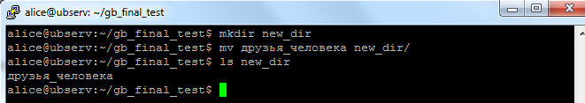

## Задание

1. Используя команду cat в терминале операционной системы Linux, создать
два файла Домашние животные (заполнив файл собаками, кошками,
хомяками) и Вьючные животными заполнив файл Лошадьми, верблюдами и
ослы), а затем объединить их. Просмотреть содержимое созданного файла.
Переименовать файл, дав ему новое имя (Друзья человека).

```
 alice@ubserv:~/gb_final_test$ cat >> домашние_животные
 собаки
 кошки
 хомяки
```


```
alice@ubserv:~/gb_final_test$ cat >> вьючные_животные
лошади
верблюды
ослы
```


```
alice@ubserv:~/gb_final_test$ cat домашние_животные вьючные_животные > животные
alice@ubserv:~/gb_final_test$ cat животные
собаки
кошки
хомяки
лошади
верблюды
ослы
alice@ubserv:~/gb_final_test$ mv животные друзья_человека
alice@ubserv:~/gb_final_test$ ls
вьючные_животные  домашние_животные  друзья_человека
alice@ubserv:~/gb_final_test$
```


2. Создать директорию, переместить файл туда.

```
alice@ubserv:~/gb_final_test$ mkdir new_dir
alice@ubserv:~/gb_final_test$ mv друзья_человека new_dir/
alice@ubserv:~/gb_final_test$ ls new_dir
друзья_человека
alice@ubserv:~/gb_final_test$
```



3. Подключить дополнительный репозиторий MySQL. Установить любой пакет
из этого репозитория.


